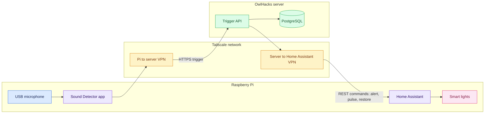

# Audio Trigger Flow

This diagram shows how a sound detected on the Raspberry Pi becomes a visual
light alert through the Tailscale network.

The pulse is implemented by alternating Home Assistant `turn_on` and
`turn_off` commands. This does not depend on the light integration supporting
Home Assistant's optional `flash` field.
